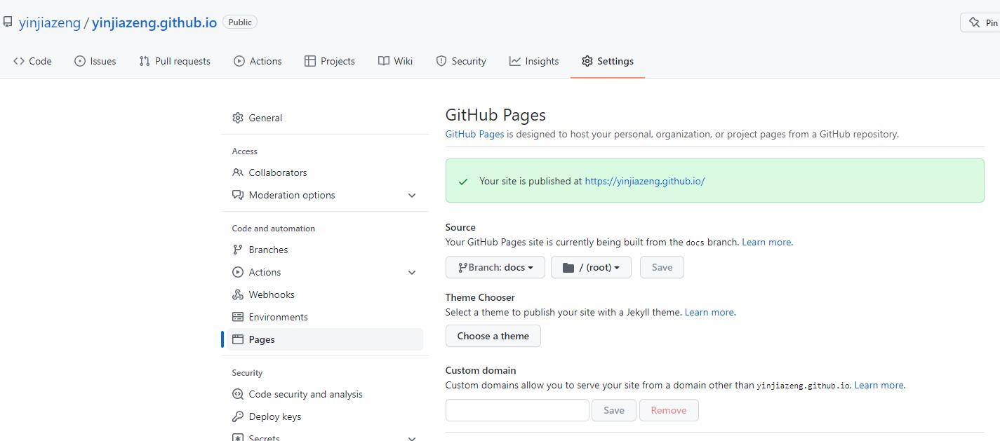
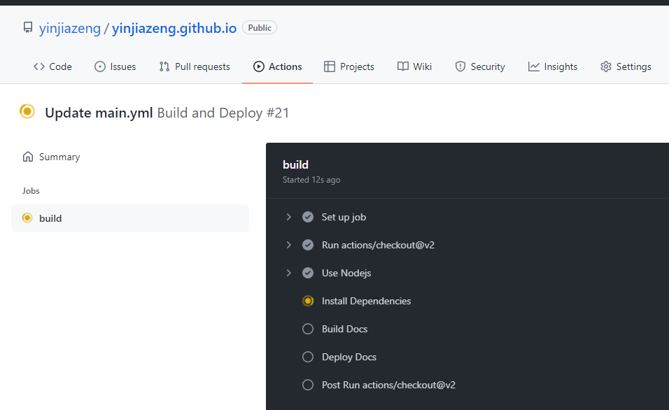
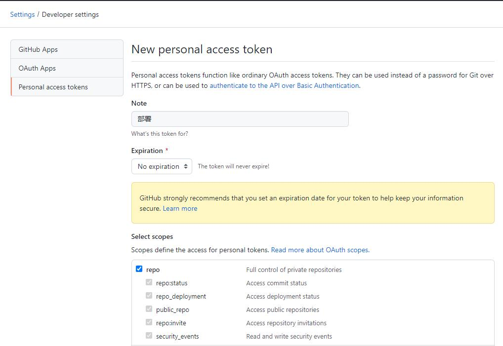
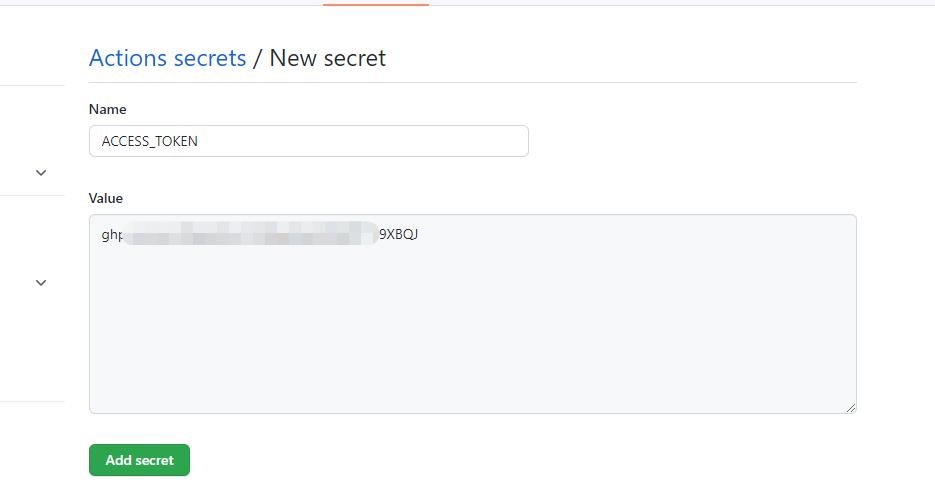

## 介绍

在Github上自动化部署的方案有很多，比如 [Jenkins](https://jenkins.io/) 和 [Travis-CI](https://travis-ci.com/)，Github自己也推出了 [Github Actions](https://docs.github.com/en/actions)，相较于其他的方案使用更加方便简单，这里就以个人博客为例介绍一下如何使用Github Actions对静态站点进行自动化部署。

## 创建站点

在Github上创建一个username.github.io的仓库，这里username就是当前账户的用户名，默认只有master分支，该分支用于存放博客的源文件。再新建一个docs分支，该分支用于部署Github Pages，进入Settings > Pages创建静态站点，选择docs分支，访问目录选择root，点击save保存后等待服务生效即可。



创建博客的工具有很多，比较流行的有[hexo](https://hexo.io/) 和 [vuepress](https://vuepress.vuejs.org/)等，可以根据自己喜好自由选择，这里使用的是 [docfree](https://github.com/yinjiazeng/docfree)，工具使用流程不再说明，然后在master分支将源文件提交到github上。

## 创建脚本

在Github仓库中进入Actions选项，里面包含了很多脚本程模板，我们点击 `set up a workflow yourself` 链接创建自定义脚本，将默认内容替换为以下代码：

```
name: Build and Deploy

on:
  push:
    branches: [ master ]

  workflow_dispatch:

jobs:
  build:
    runs-on: ubuntu-latest

    steps:
      - uses: actions/checkout@v2

      - name: Use Nodejs
        uses: actions/setup-node@v1
        with:
          node-version: 16
          
      - name: Install Dependencies
        run: yarn install

      - name: Build Docs
        run: yarn build
        
      - name: Deploy Docs
        uses: JamesIves/github-pages-deploy-action@releases/v4
        with:
          branch: docs
          folder: docs/.docfree/dist
          clean: false
```

该脚本的执行流程就是，只要master分支有新的推送，就会由上到下依次执行steps中的任务，最终将编译好的静态资源提交到 `docs` 分支中，脚本配置很多，详见[官方文档](https://docs.github.com/en/actions/using-workflows/workflow-syntax-for-github-actions)。

点击右侧的 `Start commit` 按钮保存并提交脚本文件，再点击 `Actions` 选项，可以看到任务已经在运行了，点击执行的脚本任务，可以看到具体脚本执行的流程：



等任务全部成功运行，自动化部署个人博客就完成了。

## 部署到其他仓库

这里我们的博客是部署在同一个仓库的，如果想把博客部署到其他仓库，需要借助Github的访问令牌。假设你已新建了blog仓库存储源文件，username.github.io仓库用于站点部署，点击 `头像 > Settings > Developer settings > Personal access tokens` 新建一个令牌，名称随意，有效期选择永久，勾选repo，保存后复制生成的token。



进入blog仓库，点击 `Settings > Secrets > Actions`，新建一个秘钥，秘钥名称随意，将复制的token粘贴进去保存。



修改脚本代码如下：

```diff
name: Build and Deploy

on:
  push:
    branches: [ master ]

  workflow_dispatch:

jobs:
  build:
    runs-on: ubuntu-latest

    steps:
      - uses: actions/checkout@v2

      - name: Use Nodejs
        uses: actions/setup-node@v1
        with:
          node-version: 16
          
      - name: Install Dependencies
        run: yarn install

      - name: Build Docs
        run: yarn build
        
      - name: Deploy Docs
        uses: JamesIves/github-pages-deploy-action@releases/v4
        with:
-         branch: docs
+         branch: master
          folder: docs/.docfree/dist
          clean: false
+         token: ${{ secrets.ACCESS_TOKEN }}
+         repository-name: yinjiazeng/yinjiazeng.github.io
```

每次自动化部署时，都会携带这个token，作为身份信息，这样就可以将静态资源部署到其他仓库了。